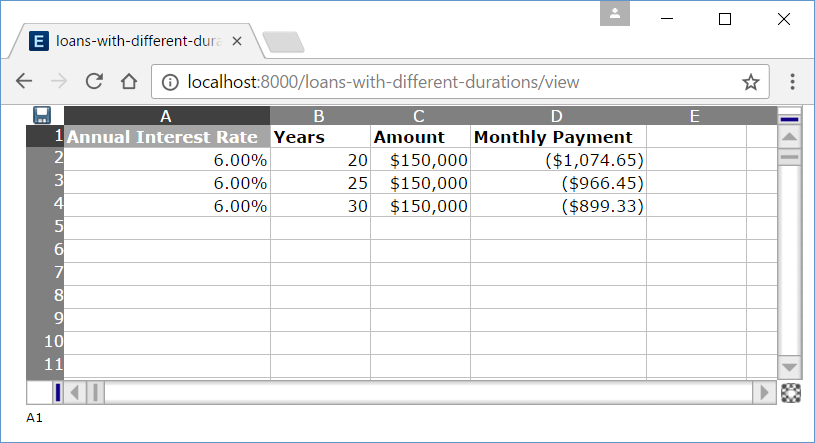

## NSocialCalcSave

[![Build Status][build-badge]][builds]
[![NuGet][nuget-badge]][nuget-pkg]
[![MyGet][myget-badge]][edge-pkgs]

NSocialCalcSave is a [.NET Standard][netstd] 1.0 library for parsing and
formatting the &ldquo;SocialCalc sheet save&rdquo; format,
a.k.a. `text/x-socialcalc`.

SocialCalc is part of the Socialtext platform, a suite of social collaboration
tools for enterprise users. For background on SocialCalc, see [Chapter 
19][aosa-19] of [The Architecture of Open Source Applications][aosa] book and
particularly section 19.5 for a brief introduction to the format.

[EtherCalc](https://ethercalc.net/) is an online spreadsheet system optimized
toward simultaneous editing, using SocialCalc as its in-browser spreadsheet
engine. NSocialCalcSave can be used with EtherCalc to read and write
spreadsheets (or portions of) programmatically using [EtherCalc's
web-based API][ethercalc-api].

## Example

Suppose the spreadsheet in the image below is authored using EtherCalc:



The following C# script retireves the spreadsheet in its native SocialCalc
sheet save format (MIME media type of `text/x-socialcalc`) and displays it
on the console:

```c#
#r "System.Net.Http"
using System.Net.Http;
var url = "http://localhost:8000/_/loans-with-different-durations";
var source = await new HttpClient().GetStringAsync(url);
Console.WriteLine(source);
```

The output would be:

```
socialcalc:version:1.0
MIME-Version: 1.0
Content-Type: multipart/mixed; boundary=SocialCalcSpreadsheetControlSave
--SocialCalcSpreadsheetControlSave
Content-type: text/plain; charset=UTF-8

# SocialCalc Spreadsheet Control Save
version:1.0
part:sheet
part:edit
part:audit
--SocialCalcSpreadsheetControlSave
Content-type: text/plain; charset=UTF-8

version:1.5
cell:A1:t:Annual Interest Rate:f:1
cell:B1:t:Years:f:1
cell:C1:t:Amount:f:1
cell:D1:t:Monthly Payment:f:1
cell:A2:v:0.06:ntvf:1
cell:B2:v:20
cell:C2:v:150000:ntvf:2
cell:D2:vtf:n$:-1074.6465877172643:PMT(A2/12,B2*12,C2):ntvf:3
cell:A3:v:0.06:ntvf:1
cell:B3:v:25
cell:C3:v:150000:ntvf:2
cell:D3:vtf:n$:-966.4521022282755:PMT(A3/12,B3*12,C3):ntvf:3
cell:A4:v:0.06:ntvf:1
cell:B4:v:30
cell:C4:v:150000:ntvf:2
cell:D4:vtf:n$:-899.3257877291385:PMT(A4/12,B4*12,C4):ntvf:3
col:A:w:165
col:D:w:141
sheet:c:4:r:4:tvf:4
font:1:normal bold * *
valueformat:1:#,##0.00%
valueformat:2:$#,##0
valueformat:3:$#,##0.00_);($#,##0.00)
valueformat:4:text-wiki
--SocialCalcSpreadsheetControlSave
Content-type: text/plain; charset=UTF-8

version:1.0
rowpane:0:1:1
colpane:0:1:1
ecell:A1
--SocialCalcSpreadsheetControlSave
Content-type: text/plain; charset=UTF-8

--SocialCalcSpreadsheetControlSave--
```

The `text/x-socialcalc` format actually embeds a multi-part MIME format and
the sheet source is typically found in the second part. The following C#
script shows how to extract just the sheet part using
`SocialCalcMime.ParseSheetSource`:

```c#
#r "System.Net.Http"
#r "NSocialCalcSave.dll"
using System.Net.Http;
using NSocialCalcSave;
var url = "http://localhost:8000/_/loans-with-different-durations";
var source = await new HttpClient().GetStringAsync(url);
var ss = SocialCalcMime.ParseSheetSource(source);
Console.WriteLine(ss);
```

The output would be:

```
version:1.5
cell:A1:t:Annual Interest Rate:f:1
cell:B1:t:Years:f:1
cell:C1:t:Amount:f:1
cell:D1:t:Monthly Payment:f:1
cell:A2:v:0.06:ntvf:1
cell:B2:v:20
cell:C2:v:150000:ntvf:2
cell:D2:vtf:n$:-1074.6465877172643:PMT(A2/12,B2*12,C2):ntvf:3
cell:A3:v:0.06:ntvf:1
cell:B3:v:25
cell:C3:v:150000:ntvf:2
cell:D3:vtf:n$:-966.4521022282755:PMT(A3/12,B3*12,C3):ntvf:3
cell:A4:v:0.06:ntvf:1
cell:B4:v:30
cell:C4:v:150000:ntvf:2
cell:D4:vtf:n$:-899.3257877291385:PMT(A4/12,B4*12,C4):ntvf:3
col:A:w:165
col:D:w:141
sheet:c:4:r:4:tvf:4
font:1:normal bold * *
valueformat:1:#,##0.00%
valueformat:2:$#,##0
valueformat:3:$#,##0.00_);($#,##0.00)
valueformat:4:text-wiki```
```

Finally, `SocialCalcFormat.ParseSheetSave` can be used to parse the above
into an object model (`ISheet` and `ICell`) that can then be harnessed at
run-time and the following C# script demontrates exactly that:

```c#
#r "System.Net.Http"
#r "NSocialCalcSave.dll"
using System.Net.Http;
using NSocialCalcSave;
var url = "http://localhost:8000/_/loans-with-different-durations";
var source = await new HttpClient().GetStringAsync(url);
var ss = SocialCalcMime.ParseSheetSource(source);
var s = SocialCalcFormat.ParseSheetSave(ss);
foreach (var cell in s.Cells)
{
    var content = cell.Value;
    Console.WriteLine($"{cell.Key} | t = {content.DataType,-7} | vt = {content.ValueType,-8}): " +
                      content.DataValue + " = " + content.Formula);
}
```

The output would be:

```
A1 | t = Text    | vt = Text    : Annual Interest Rate = 
B1 | t = Text    | vt = Text    : Years = 
C1 | t = Text    | vt = Text    : Amount = 
D1 | t = Text    | vt = Text    : Monthly Payment = 
A2 | t = Number  | vt = Number  : 0.06 = 
B2 | t = Number  | vt = Number  : 20 = 
C2 | t = Number  | vt = Number  : 150000 = 
D2 | t = Formula | vt = Currency: -1074.64658771726 = PMT(A2/12,B2*12,C2)
A3 | t = Number  | vt = Number  : 0.06 = 
B3 | t = Number  | vt = Number  : 25 = 
C3 | t = Number  | vt = Number  : 150000 = 
D3 | t = Formula | vt = Currency: -966.452102228276 = PMT(A3/12,B3*12,C3)
A4 | t = Number  | vt = Number  : 0.06 = 
B4 | t = Number  | vt = Number  : 30 = 
C4 | t = Number  | vt = Number  : 150000 = 
D4 | t = Formula | vt = Currency: -899.325787729138 = PMT(A4/12,B4*12,C4)
```

In addition to parsing, you can format a graph of `Sheet` and `Cell` objects
into the SocialCalc sheet save format. The C# script below shows the minimal
code for formatting a sheet with a single cell (C3) containing the value of
&pi;, using `SocialCalcFormat.Format`:

```c#
#r "NSocialCalcSave.dll"
using NSocialCalcSave;
var s = SocialCalcFormat.Format(new Sheet
{
    LastCol = 3,
    LastRow = 3,
    DefaultTextValueFormat = 1,
    ValueFormats = new []
    {
        new KeyValuePair<int, string>(1, "text-wiki"),
    },
    Cells = new[]
    {
        new KeyValuePair<string, ICell>("C3", new Cell
        {
            DataType = CellDataType.Number,
            ValueType = CellValueType.Number,
            DataValue = Math.PI 
        }),
    }
});
Console.WriteLine(s);
```

NSocialCalcSave does not validate the integrity of the sheet. This is left as
the responsibility of the caller of `SocialCalcFormat.Format`.


[builds]: https://ci.appveyor.com/project/raboof/nsocialcalcsave
[build-badge]: https://img.shields.io/appveyor/ci/raboof/nsocialcalcsave.svg
[myget-badge]: https://img.shields.io/myget/raboof/v/NSocialCalcSave.svg?label=myget
[edge-pkgs]: https://www.myget.org/feed/raboof/package/nuget/NSocialCalcSave
[nuget-badge]: https://img.shields.io/nuget/v/NSocialCalcSave.svg
[nuget-pkg]: https://www.nuget.org/packages/NSocialCalcSave
[netstd]: https://docs.microsoft.com/en-us/dotnet/articles/standard/library
[aosa]: http://www.aosabook.org/
[aosa-19]: http://www.aosabook.org/en/socialcalc.html
[ethercalc-api]: https://github.com/audreyt/ethercalc/blob/d42af4142482419c7bbb5970d30817c8e84cd6ca/API.md
